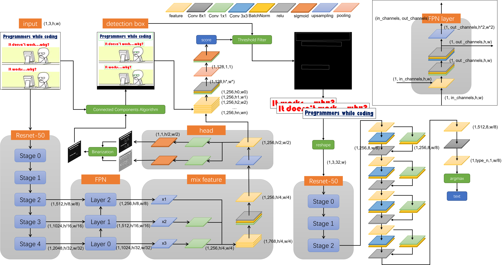

# Scene_Text_Recognition
A text recognition model based on CNN and CTCloss.
## model structure

## Install
###Install pytorch(cpu):

    conda install pytorch torchvision torchaudio cpuonly -c pytorch
###Install dependencies:

    pip install -r requirements.txt
###Download model (default save path:./ckpt/):

    https://drive.google.com/file/d/1I1Bs-q5WSbsjX8yorGKriiNFZyG-EHfN/view?usp=share_link
## Run:
    python app.py
